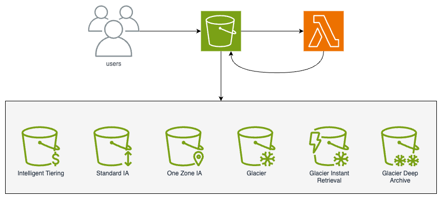

## Amazon S3 Change Storage Class

Amazon S3 offers a range of [storage classes](https://docs.aws.amazon.com/AmazonS3/latest/userguide/storage-class-intro.html) that you can choose from based on the performance, data access, resiliency, and cost requirements of your workloads. S3 storage classes are purpose-built to provide the lowest cost storage for different access patterns. S3 storage classes are ideal for virtually any use case, including those with demanding performance needs, data lakes, residency requirements, unknown or changing access patterns, or archival storage.

We can use storage classes in various ways, but we will focus on moving objects between storage classes through events with AWS Lambda integration.

## Architecture Blueprint


## Requirements

- [Amazon S3](https://aws.amazon.com/s3/?nc1=h_ls)
- [AWS Lambda](https://aws.amazon.com/lambda/?nc1=h_ls)

## When should you use this code?

This python code provisioned on AWS Lambda is used when we want to change the storage class of the objects inserted in Amazon S3 through events, that is, when the file is inserted into the S3 bucket.

## Usage
### AWS Lambda

Create a Lambda function, for this scenario we use Runtime python 3.9:

```
import os
import boto3
import logging
from botocore.exceptions import ClientError

# Configure logging
logger = logging.getLogger()
logger.setLevel(logging.INFO)

# Create an S3 client
s3 = boto3.client('s3')

def lambda_handler(event, context):
    # Retrieve the bucket name from the environment variable
    bucket_name = os.environ.get('BUCKET_NAME')
    if not bucket_name:
        logger.error('BUCKET_NAME environment variable is not set.')
        return {
            'statusCode': 500,
            'body': 'Internal Server Error'
        }

    # Retrieve the target storage class from the environment variable
    target_storage_class = os.environ.get('TARGET_STORAGE_CLASS', 'INTELLIGENT_TIERING')

    # Check if the 'Records' key exists in the event object
    if 'Records' not in event:
        logger.error('Invalid event structure. No "Records" key found.')
        return {
            'statusCode': 400,
            'body': 'Invalid event structure.'
        }

    # Move the object to the new storage class
    try:
        object_key = event['Records'][0]['s3']['object']['key']

        # Check if the object exists
        try:
            s3.head_object(Bucket=bucket_name, Key=object_key)
        except ClientError as e:
            if e.response['Error']['Code'] == '404':
                logger.error(f'Error: The specified key {object_key} does not exist in bucket {bucket_name}.')
                return {
                    'statusCode': 404,
                    'body': 'The specified key does not exist.'
                }
            else:
                logger.error(f'Unexpected error: {e}')
                return {
                    'statusCode': 500,
                    'body': 'Internal Server Error'
                }

        copy_source = {'Bucket': bucket_name, 'Key': object_key}

        s3.copy_object(
            Bucket=bucket_name,
            Key=object_key,
            CopySource=copy_source,
            StorageClass=target_storage_class,
            MetadataDirective='COPY'
        )

        logger.info(f'Moved object {object_key} in bucket {bucket_name} to {target_storage_class} storage class.')

        return {
            'statusCode': 200,
            'body': 'Object storage class moved successfully.'
        }
    except ClientError as e:
        logger.error(f'Unexpected error: {e}')
        return {
            'statusCode': 500,
            'body': 'Internal Server Error'
        }
```

To configure the `TARGET_STORAGE_CLASS` environment variable for your Lambda function, you can follow these steps:

1. Open the AWS Lambda console and navigate to your function.

2. Under the "Configuration" tab, click on "Environment variables".

3. Click "Edit" and then "Add environment variable".

4. Enter `TARGET_STORAGE_CLASS` as the key, and the desired storage class (e.g., `GLACIER`) as the value.

5. Click "Save" to apply the changes.

After configuring the environment variable, your Lambda function will use the specified storage class when moving objects in the S3 bucket.

Note that the valid values for the `target_storage_class` are:

- `'STANDARD'`

- `'REDUCED_REDUNDANCY'`

- `'STANDARD_IA'`

- `'ONEZONE_IA'`

- `'INTELLIGENT_TIERING'`

- `'GLACIER'`

- `'DEEP_ARCHIVE'`

- `'OUTPOSTS'`

If an invalid value is provided for the `TARGET_STORAGE_CLASS` environment variable, the Lambda function will use the default value of `'INTELLIGENT_TIERING'`.

You must also set an environment variable for the bucket name:

1. Under the "Configuration" tab, click on "Environment variables".

2. Click "Edit" and then "Add environment variable".

3. Enter `BUCKET_NAME` as the key, and the the name of the bucket to be used as the value.

4. Click "Save" to apply the changes.

Finally, set up a trigger:

In the AWS Lambda above, add a trigger.

1. Choose **S3**
 
2. In **bucket**, choose the bucket that will receive the objects (the same as configured in the environment variables in the lambda).

3. In **Event types**, select the event you want to use in this scenario (in this example we leave only “PUT”).

4. Finally press the “Add” button

## License
This library is licensed under the MIT-0 License. See the LICENSE file.
